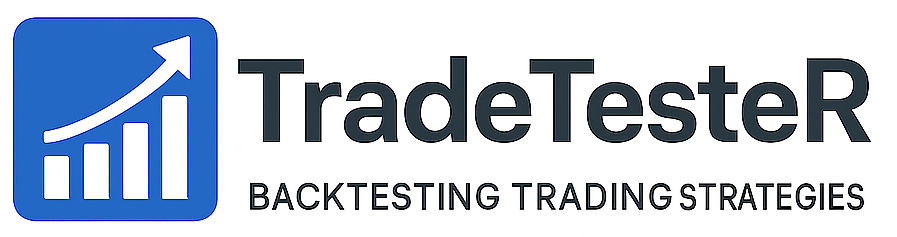

# TradeTesterR 

## Democratizing Access to Professional-Grade Backtesting

TradeTesterR is an open-source R framework that brings institutional-quality backtesting capabilities to individual traders, academic researchers, and educational institutions. By combining sophisticated functionality with transparent, understandable architecture, this framework enables both practical strategy development and effective financial education.

## Why TradeTesterR?

The current landscape of backtesting software presents a stark dichotomy:
- **Commercial platforms** (TradeStation, MetaTrader, NinjaTrader) offer comprehensive features but require substantial licensing fees and lock users into proprietary ecosystems
- **Existing R solutions** like quantstrat present steep learning curves with complex architectures that deter many users
- **Simple alternatives** sacrifice essential features like realistic order execution and sophisticated position management

TradeTesterR bridges this gap by providing:
- 🎓 **Educational Transparency**: Every step of the trading process is visible and verifiable
- 💰 **Free & Open Source**: No licensing fees or platform lock-in
- 🚀 **Progressive Complexity**: Start simple, grow sophisticated
- 📊 **Realistic Simulation**: Professional-grade execution modeling

## Key Features

### 🏗️ Dual-Timeframe Architecture
Separates strategy logic from execution mechanics, teaching and enforcing the crucial distinction between when decisions are made and when trades execute:
- Strategy timeframe for signal generation (e.g., daily bars)
- Execution timeframe for realistic fills (e.g., minute bars)
- Prevents look-ahead bias while maintaining code clarity

### 📈 Comprehensive Order Management
- Market, limit, stop, and stop-limit orders
- Realistic order execution with slippage modeling
- Partial fills and order rejection handling
- Position pyramiding and scaling options

### 🎯 Sophisticated Exit Strategies
- Fixed and trailing stop losses/take profits
- Time-based exits and position reductions
- Signal-based exits with customizable logic
- Multiple simultaneous exit conditions

### 💼 Professional Position Sizing
- Fixed dollar amount sizing
- Percentage of equity sizing
- Volatility-based position sizing
- Kelly criterion implementation
- Support for futures contracts and leverage

### 🔍 Transparent Execution
- Every trade is traceable through the system
- Inspect signals, orders, and positions at any point
- Detailed execution logs and trade analysis
- No "black box" calculations

### 📊 Advanced Analytics
- Comprehensive performance metrics
- Walk-forward optimization capabilities
- Parameter stability analysis
- Monte Carlo simulation support
- Multi-dimensional parameter visualization

### 🏛️ Built for Education
- Clear, documented code structure
- Progressive learning path
- Extensive examples from simple to complex
- Visible market mechanics for teaching

## Installation

```r
# Install from GitHub
# install.packages("devtools")
devtools::install_github("alb3rtazzo/TradeTesteR")
```

## Quick Start

```r
library(TradeTesterR)

# Load your data
price_data <- fread("your_data.csv")

# Define a simple strategy
my_strategy <- function(price) {
  # Calculate indicators
  price[, SMA20 := SMA(Close, 20)]
  price[, SMA50 := SMA(Close, 50)]
  
  # Generate signals
  price[, BuySignal := SMA20 > SMA50 & shift(SMA20) <= shift(SMA50)]
  price[, SellSignal := SMA20 < SMA50 & shift(SMA20) >= shift(SMA50)]
  
  # Set entry parameters
  price[BuySignal == TRUE, EntryPrice := shift(Open, 1, type="lead")]
  price[BuySignal == TRUE, EntryType := "Market"]
  
  return(price)
}

# Run backtest
results <- backtest(
  data = my_strategy(price_data),
  initial_equity = 10000,
  position_size = 1000,
  instrument_type = "stocks"
)

# Analyze results
print(results$metrics)
plot(results$equity_curve)
```

## Documentation

### Tutorials
1. [Getting Started](docs/01_getting_started.md) - Basic setup and first strategy
2. [Strategy Development](docs/02_strategy_development.md) - Building trading logic
3. [Order Types & Execution](docs/03_order_execution.md) - Understanding order mechanics
4. [Position Management](docs/04_position_management.md) - Sizing and risk control
5. [Exit Strategies](docs/05_exit_strategies.md) - Professional exit techniques
6. [Optimization](docs/06_optimization.md) - Parameter tuning and walk-forward analysis

### Examples
- [Bollinger Band Mean Reversion](inst/examples/bollinger_bands.R)
- [Dual Moving Average Crossover](inst/examples/ma_crossover.R)
- [RSI Divergence Strategy](inst/examples/rsi_divergence.R)
- [Multi-Timeframe Analysis](inst/examples/multi_timeframe.R)
- [Portfolio Strategies](inst/examples/portfolio.R)

## Architecture Layers

TradeTesterR implements progressive disclosure through a layered architecture:

1. **Simple Strategy Interface**: Basic functions and indicators for rapid prototyping
2. **Signal Generation**: Data transformations and entry/exit rules
3. **Order Management**: Backtest function and position tracking
4. **Execution Simulation**: Dual timeframe engine and transaction costs

Users can work at any layer based on their expertise and requirements.

## Contributing

We welcome contributions! Please see our [Contributing Guide](CONTRIBUTING.md) for details.

### Areas for Contribution
- Additional strategy examples
- New position sizing algorithms
- Enhanced visualization tools
- Performance optimizations
- Documentation improvements

## Academic Use

TradeTesterR is designed for educational institutions:
- Free for academic use
- Transparent for teaching market mechanics
- Suitable for research and thesis work
- No licensing restrictions for students

If you use TradeTesterR in academic work, please cite:
```
Pallotta, A. (2025). TradeTesterR: An Open-Source Backtesting Framework 
for Accessible Quantitative Finance. Available at: 
https://github.com/alb3rtazzo/TradeTesterR
```

## License

This project is licensed under the GPL-3 License - see the [LICENSE](LICENSE) file for details.

### What this means:
- ✅ Use freely for any purpose
- ✅ Modify and distribute
- ✅ Use in commercial applications
- ❌ Cannot close-source derivatives
- ❌ Cannot resell as proprietary software

## Support

- 📧 Email: pallottaalberto@gmail.com
- 🐛 Issues: [GitHub Issues](https://github.com/AlbertoPallotta/TradeTesterR/issues)
- 💬 Discussions: [GitHub Discussions](https://github.com/AlbertoPallotta/TradeTesterR/discussions)

## Acknowledgments

This framework emerged from PhD research on democratizing quantitative finance tools. Special thanks to the R community and all contributors who help make professional trading tools accessible to everyone.

---

*"In an era where algorithmic and systematic trading increasingly dominate markets, democratizing access to development tools becomes essential for maintaining market diversity and opportunity."* - TradeTesterR Philosophy
